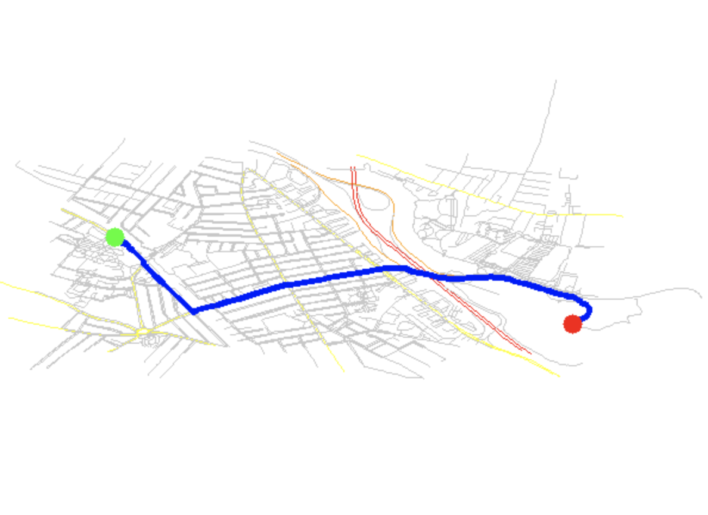

```
osm_pathfinding/
├── CMakeLists.txt
├── include/
│   ├── osm_parser.hpp
│   ├── graph.hpp
│   └── visualizer.hpp
└── src/
    ├── main.cpp
    ├── osm_parser.cpp
    ├── graph.cpp
    └── visualizer.cpp
```
Demo: (I choose Tufts University to a park aside Mystic River)

